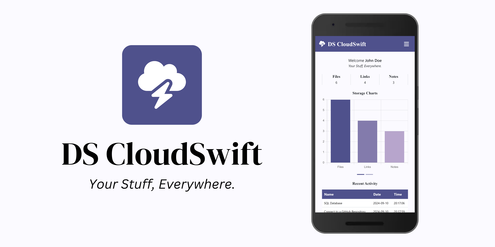

# DS CloudSwift

## _Your Stuff, Everywhere._

DS CloudSwift is your ultimate companion for easy, fast, and reliable cloud storage. With DS CloudSwift you can seamlessly save, organize, and access your files, links, and notes from any device at any time. Additionally, DS CloudSwift features “CloudSwift AI”, your personal assistant, ready to help with any task or conversation. Enjoy the freedom to have “Your Stuff, Everywhere”, and elevate your cloud storage experience like never before.

### Key Features

- Intuitive Home Dashboard.
- Seamless Cloud Storage.
- CloudSwift AI.
- User Interface.
- Security.
- Cross-Platform Sync.

### Screenshots

### Release Notes

- Enhanced Performance.

###### DS CloudSwift | Version 2.0.10

See also: [DS CloudSwift - RESTful Web Service](https://github.com/dsvillalobos/ds-cloudswift-rest)
